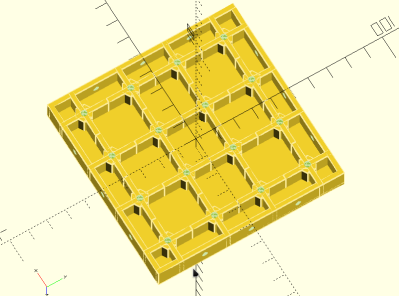

# pract_plate
Pact Plate clone written in OpenScad.

OpenScad is a Free Open Source Programmic CAD.
https://www.openscad.org/

Pract Plate is a practical, re-usable, light mounting plate solution for 3d printer owners.  It uses hex nuts embedded during the printing process to fasten any drilled bolts.  OpenScad means I can make the design completely modular.  One of the main problems I had with the original Pact Plate was that it was M4.  So, I decided to make my design completely parametric to meet a variety of needs.  

Q: Does this infringe on Pact Plate's patent? 

A: No, it uses hex nuts jammed into the plate during print for better or worse.  It should be fine for most DIY solutions.  I would refrain from using this in an official factory setting where it may be mounted on it's side.  However, I can comfortably say that it can withstand a very heavy computer on top of it even when printed on PLA.  

Q: How does it compare to Pact Plate?

A: It's lacking recessed holes, a more intricate design, and it's not injection molded.  It's a scrappy DIY version created because I couldn't wait any longer.  

Q: How can donate?  

A: I'm hoping to fund development with piecemeal features that can be pushed to this open repository for everyone.  I'd run micro-funding rounds via small Kickstarter rounds.  For example, I'm hoping to open a Kickstarter for a indented grid marking 1mm lines on the top.   

Q: I'm a designer familiar with OpenScad myself mind if I make a PR?

A: Yeah, I could use a helping hand.  I can't do this all myself.  Just send a PR, and I'll give you my feedback or pull with a thank you.  

Q: I can't design, but I can print them?

A: If they help you, that's great.  If you have any problems, feel free to post issues.  I want this plate to work for everyone.  Please send me your feedback on here or on reddit.  My username is the same: Gragundier.  

Q: License?

A: Uhh, it's still too early to really put a official license.  Whatever I say goes I guess. But if you follow GPLv2 rules, I won't really get mad at you.  

https://www.gnu.org/licenses/old-licenses/gpl-2.0.html
